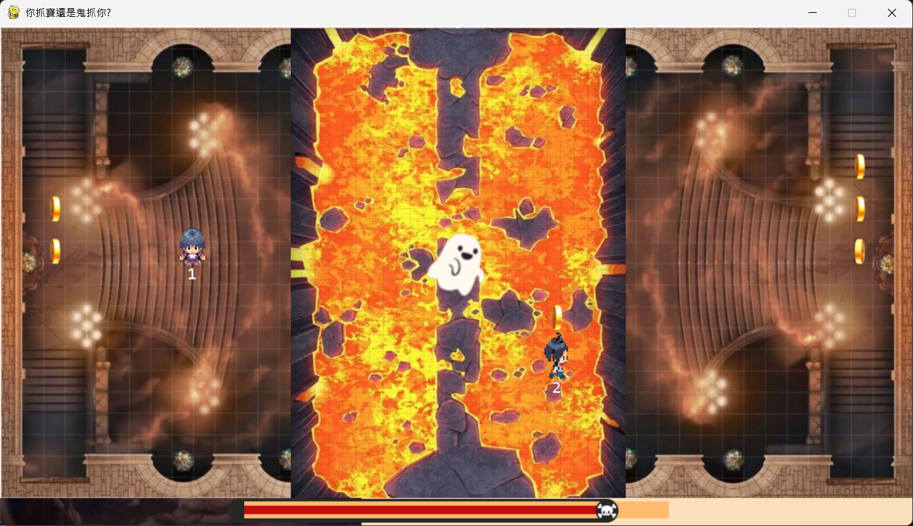

# 🎮 Python Game Series

*A series of small projects developed during the Fundamentals of Multimedia course, using Python libraries such as Turtle, Tkinter, and Pygame.*

---

### **Homework/ad1: Universe Discovery Game**  
  *by Text printing*

### **Homework/ad2: Drawing the Olympic 5 rings symbol**  
  *by Turtle*

### **Homework/ad3: Guess Number Game**  
  *by Tkinter and Random*

### **Homework/ad4: Adjusting Color Game**  
  *by Tkinter, Random and Time*  
  
  Random a color and try to adjusting true color as soon as posible

### **Homework/ad5: Visual Motion Of Circle And Square**
  *by Pygame, Random and Math*  
  
  The circle moves according to near and far vision, the square moves in a left-right-left direction, when the rectangle hits the edge of the window, the color of the circle changes

### **Homework/ad6: Football Game**  
  *by Pygame, Random and Time*  
  
  Use the 4 W, A, S, D keys to control the pink circle representing the player kicking the ball and the goal; depending on the position you score, there will be corresponding high or low points. Time: 2 minutes

### **Homework/ad7: Skilled Ball Catcher**  
  *by Pygame, Random and Time*  
  
  Use clicks to move the rectangular basket to catch the falling colored balls. Catching a ball will change the color of the basket and gradually make the basket larger while adding 1 point. At the same time, the player must skillfully avoid empty balls bouncing up from below. If hit by an empty ball, the basket will become invisible for a period of time, creating an obstacle for the player. Time: 100s

### **ad8+9: Way Back Home**  
  *by Pygame, Random, Time and sound effects*  
  
  A game of chance-based adventure where players use the W, A, S, and D keys to navigate through various obstacles, where randomly placed hidden boxes contain either a heart or a bomb, affecting survival chances. The goal is to reach the housing area at the end of the map with at least one life remaining to win

### **game: The Haunted Land Heist**  
  *by Pygame, Time and sound effects*  
  
In a remote town, two wealthy merchants each possess three precious gold coins. To claim the title of richest, they invade each other's territory to steal each coin one by one, traversing the dangerous "Haunted Land" guarded by a predatory spirit.

The game includes a start screen, a visual timeline that moves from left to right, and a score display at the end of each match. Player 1 uses WASD controls, while Player 2 uses the arrow keys.

A ghost patrols the area and begins a chase when players enter the Haunted Land, targeting the nearest player. Players collect coins and bring them back to their base, where the coins are automatically arranged into empty slots to create a neat layout.

Quick reflexes, clever thieving skills, and survival abilities will determine who becomes the richest merchant.
📸 *Screenshot*

## 🚀 How to Run

1. Clone the repository:
   git clone <repo-link>

2. Install dependencies:
   pip install pygame tkinter

3. Run a game:
   python xx.py

